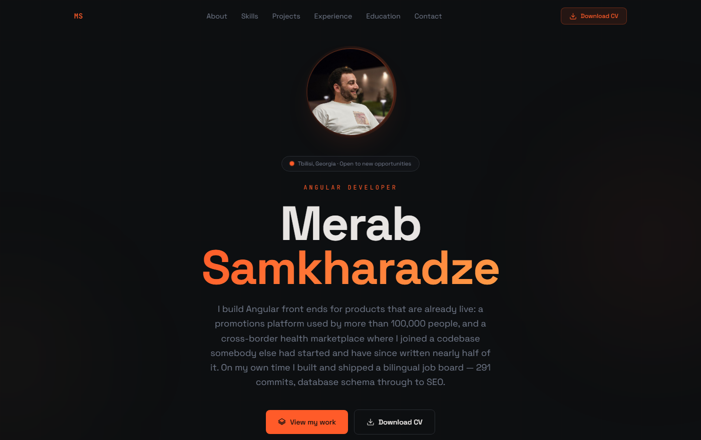

<div align="center">

# Merab Samkharadze — Portfolio

**Angular developer, Tbilisi.** A single-page portfolio built in Angular 21 —
standalone components, signal-based state, zoneless change detection, and a tested core.

[](https://angular.dev)
[](https://www.typescriptlang.org)
[](https://tailwindcss.com)
[](https://vitest.dev)
[](https://eslint.org)
[](https://angular.dev/guide/zoneless)
[](https://angular.dev/guide/components/importing)

**Live:** _not deployed yet_ — see [Deployment](#deployment) ·
**CV:** [`Merab_Samkharadze_CV.pdf`](public/Merab_Samkharadze_CV.pdf)

</div>



---

## What this is

A portfolio, and a working sample of how I structure an Angular application. The page itself is
the argument: if the code behind it is careless, nothing written on it counts for much.

It is deliberately **not** a pitch aimed at one vacancy. It states what I have built, at what
scale, and with what — and leaves the conclusion to the reader.

|              |                                                        |
| ------------ | ------------------------------------------------------ |
| Bundle       | **81.9 kB** transferred · 325.7 kB raw                 |
| Source       | 22 components, 1 directive, 4 services, 9 barrel files |
| Largest file | 196 lines — no file in this repository exceeds 200     |
| Tests        | **46** across 5 spec files                             |
| Lint         | **0** errors, 0 warnings                               |
| NgModules    | **0**                                                  |
| zone.js      | not installed                                          |

---

## Technically interesting bits

- **Zoneless change detection.** No `zone.js` in the bundle at all. Every update travels through a
  signal, and every component is `OnPush`.
- **Content is typed data, not markup** — and it is _injected_, not imported. Copy lives in
  `core/content/`, one file per section, behind interfaces. `PortfolioStore` reads it through an
  `InjectionToken`, so a spec can substitute a fake in two lines and a future CMS would replace one
  provider.
- **Architecture boundaries that fail the build.** `eslint.config.js` puts `no-restricted-imports`
  on `core/**` and `shared/**`. If someone makes the domain depend on a feature, CI stops them —
  the layering is a rule, not a paragraph in this file.
- **One `IntersectionObserver` for the whole page.** A per-element observer would mean sixty
  instances competing for the same frame budget. `RevealObserver` is a root singleton with a
  `WeakMap` of callbacks, and each element unobserves itself once it has animated in.
- **A contact form with no backend that still works.** With no endpoint configured it composes a
  fully pre-filled `mailto:` and hands it to the visitor's mail client. Nothing is silently dropped,
  and the UI says exactly what happened.
- **Tests that guard the writing, not just the code.** Two specs fail the build if the rendered page
  ever contains job-application framing (`match score`, `the vacancy`, `role fit`) or CV clichés
  (`detail-oriented`, `hard-working`, `team player`, `fast learner`, …). Prose regressions are as
  easy to ship as code regressions; this makes them loud.
- **No icon library.** Every glyph is `<path>` data on a 24×24 grid, rendered by one `@for` loop —
  no dependency, no sanitiser bypass, no unused weight.
- **Reduced motion is handled in CSS, not JavaScript.** Every reveal, marquee and float is disabled
  inside `@media (prefers-reduced-motion: reduce)`, so the behaviour cannot drift from the styling.

---

## Tech stack

| Concern          | Choice                                                               |
| ---------------- | -------------------------------------------------------------------- |
| Framework        | Angular **21.2** — standalone components, no NgModules               |
| Change detection | **Zoneless** (`provideZonelessChangeDetection`), `OnPush` throughout |
| State            | Signals — `signal` / `computed`; no external store required          |
| Styling          | **Tailwind CSS v4**, CSS-first `@theme` tokens                       |
| Forms            | Reactive Forms, strictly typed via `nonNullable.group`               |
| Testing          | **Vitest 4** (Angular CLI runner), jsdom                             |
| Types            | TypeScript **5.9** strict, plus `strictTemplates`                    |
| Build            | `@angular/build:application`                                         |

> **Node:** Angular 22 requires Node ≥ 22.22.3. This project targets Angular 21.2, the latest
> release that runs on Node 22.17. `ng update` handles the jump after a Node upgrade.

---

## Getting started

```bash
git clone <this-repo>
cd portfolio
npm install

npm start        # dev server → http://localhost:4200
```

### Scripts

| Command                | What it does                                           |
| ---------------------- | ------------------------------------------------------ |
| `npm start`            | Dev server with live reload                            |
| `npm test`             | Run the 46 unit tests once                             |
| `npm run lint`         | ESLint over TypeScript **and** templates               |
| `npm run lint:fix`     | The same, applying every safe fix                      |
| `npm run format`       | Prettier over the repository                           |
| `npm run format:check` | Fail if anything is unformatted (what CI runs)         |
| `npm run build`        | Production bundle → `dist/portfolio/browser`           |
| `npm run verify`       | **lint → test → build**, the whole gate in one command |

---

## Architecture

```
src/app/
├── core/                          the domain. Knows nothing about the UI.
│   ├── models/                    one file per entity, re-exported by index.ts
│   │   ├── profile.model.ts  skill.model.ts  project.model.ts
│   │   ├── experience.model.ts  education.model.ts  contact.model.ts
│   │   ├── navigation.model.ts  stat.model.ts
│   │   └── portfolio-content.model.ts   the shape of the whole content set
│   ├── content/                   ← ALL COPY LIVES HERE, one file per section
│   │   ├── profile.content.ts  about.content.ts  skills.content.ts
│   │   ├── projects.content.ts  experience.content.ts  education.content.ts
│   │   ├── contact.content.ts  navigation.content.ts
│   │   └── index.ts               assembles them into `portfolioContent`
│   ├── tokens/                    PORTFOLIO_CONTENT · PORTFOLIO_CONFIG
│   ├── services/                  portfolio-store · scroll-spy · contact-api
│   └── testing/                   providePortfolioTesting() for specs
│
├── shared/                        reusable, domain-agnostic
│   ├── directives/                reveal · reveal-observer
│   └── ui/                        icon · chip · section-heading · stat-grid · tech-list
│
├── layout/                        navbar · footer
│
└── features/                      one folder per section, each with its own parts
    ├── hero/  about/  skills/skill-group-card/
    ├── projects/{project-card, project-brief}/
    ├── experience/timeline-entry/  education/education-card/
    └── contact/{contact-channels, contact-form}/
```

### The rules, and how they are enforced

1. **Dependencies point inwards only.** `features` may use `shared` and `core`; `shared` may use
   `core`; `core` uses nothing above it. This is not a convention here — `eslint.config.js` sets
   `no-restricted-imports` on `core/**` and `shared/**`, so breaking the boundary **fails the
   build**.
2. **Content is injected, not imported.** Nothing reaches into a data file. `PortfolioStore` reads
   `PORTFOLIO_CONTENT`, provided in `app.config.ts` — which is why a test can hand it a fake in two
   lines, and why moving to a CMS would touch one provider.
3. **Sections compose, they do not render.** Every section template is a heading plus a loop over a
   card component. `contact.html` is 17 lines; the form and the channel list are their own
   components with their own tests.
4. **One observer, not sixty.** `RevealObserver` is a root singleton shared by every `[appReveal]`.

### Path aliases

No `../../../` anywhere. `tsconfig.json` maps `@core/*`, `@shared/*`, `@layout/*` and
`@features/*`, and every layer has an `index.ts` barrel, so imports read as intent:

```ts
import { PortfolioStore } from '@core/services';
import type { Project } from '@core/models';
import { Icon, StatGrid, TechList } from '@shared/ui';
```

---

## Editing the content

Everything the page says is in [`src/app/core/content/`](src/app/core/content/) — one file per
section, assembled in [`index.ts`](src/app/core/content/index.ts).

- **Skills** carry a `level` — `production` / `strong` / `working` / `familiar` — which drives the
  chip styling and the legend. Only `production` and `strong` entries reach the hero marquee.
- **Projects** with `featured: false` drop into the compact list at the bottom of the section.
- **Project links** render as a button on the card; `[]` renders nothing.
- **CV** — replace `public/Merab_Samkharadze_CV.pdf`, keeping the filename, or update
  `PROFILE.cvUrl` and the `download` attributes.
- **Photo** — replace `public/profile.jpg`.

### Theming

The entire visual identity comes off three numbers at the top of
[`src/styles.css`](src/styles.css):

```css
:root {
  --accent-h: 14;
  --accent-s: 100%;
  --accent-l: 58%; /* #ff5d2a */
}
```

Every alpha-blended use — selection highlight, scrollbar, glow line, card hover, hero grid — reads
`hsl(var(--accent) / α)`. An eleven-step ramp (`--color-primary-50` … `--color-primary-950`) is
declared in `@theme`, so `bg-primary-300` and `text-primary-700` are available as utilities.

### Contact form

`CONTACT_ENDPOINT` is empty by default, so the form composes a pre-filled `mailto:` and hands it to
the visitor's mail client — a real, working path with no server. Point the constant at a Formspree,
Netlify Forms or custom endpoint and it POSTs there instead; the `mailto:` remains the fallback if
the request fails.

---

## Testing

```bash
npm test
```

44 tests across 5 files, covering:

- `PortfolioStore` — derived views, uniqueness of ids, marquee de-duplication, ordering
- `ContactApi` — `mailto:` encoding (including the `+`-as-space trap), the endpoint-free fallback,
  and the minimum pending window
- `Reveal` directive — a stubbed `IntersectionObserver`, observer sharing, delay custom property,
  and graceful degradation when the API is absent
- `Contact` — validation rules, submit gating, the success swap, the `mailto:` fallback link
- `App` — landmarks, single `<h1>`, skip link, every nav anchor resolving, plus the two copy guards

---

## Deployment

The output is fully static.

```bash
npm run build
# deploy dist/portfolio/browser/** anywhere
```

| Host                 | How                                                                                     |
| -------------------- | --------------------------------------------------------------------------------------- |
| **Netlify**          | Drag `dist/portfolio/browser` onto [app.netlify.com/drop](https://app.netlify.com/drop) |
| **Vercel**           | `vercel deploy dist/portfolio/browser --prod`                                           |
| **GitHub Pages**     | Push the folder to `gh-pages`; build with `--base-href /<repo-name>/`                   |
| **Cloudflare Pages** | Build `npm run build`, output directory `dist/portfolio/browser`                        |

Configure the host to rewrite unknown paths to `index.html`. `index.html` already carries the title,
description, Open Graph and Twitter cards, and JSON-LD `Person` structured data.

> Opening `index.html` straight from the filesystem will **not** work — browsers block ES modules
> over `file://`. Serve it over HTTP.

---

## Accessibility & performance

- Skip link as the first tab stop; one `<h1>`; semantic landmarks throughout.
- `aria-current` on the active nav item, `aria-expanded` and `inert` on the mobile menu.
- Full `prefers-reduced-motion` support at the CSS layer.
- Focus-visible outlines on every interactive element, and `cursor: pointer` restored at the base
  layer (Tailwind v4 removed it from preflight).
- A print stylesheet turns the page into a readable one-pager; `.no-print` hides the chrome.
- Fonts preconnected with `display=swap`; the hero portrait is `fetchpriority="high"`.
- Verified at 390 px and 1440 px with no horizontal overflow.

---

## Related

- [`docs/medsocial-case-study.md`](docs/medsocial-case-study.md) — long-form case study of the
  MedSocial work, including the WebSocket and performance deep dives.

---

## Licence

The **code** is free to read, learn from and borrow.

The **content** — the writing, the CV, the photograph and the personal details — is mine and is not
licensed for reuse. If you want the structure, take the code and replace
`src/app/core/data/portfolio.content.ts` with your own.

---

<div align="center">

**Merab Samkharadze** · Tbilisi, Georgia
[Email](mailto:samkharadzemerab@gmail.com) ·
[LinkedIn](https://www.linkedin.com/in/merab-samkharadze-15301b131)

</div>
